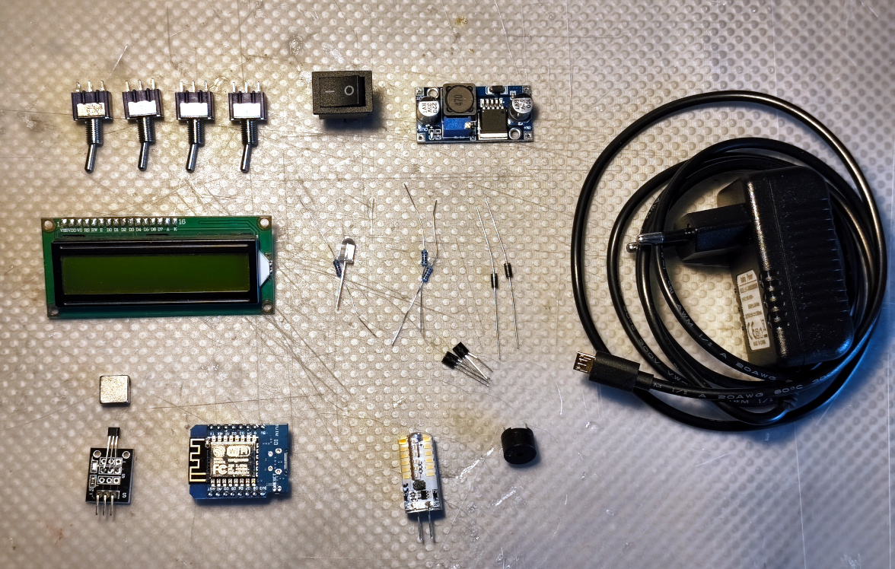
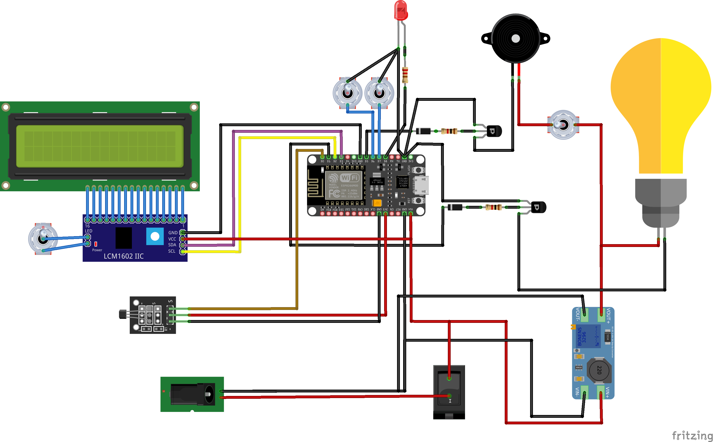

# Tür Beobachtung: DIY Door Alarm System

Welcome to the Tür Beobachtung project! This is a DIY door alarm system I created in 2019 to help my in-laws keep their bike shed door securely closed during the night at their countryside retreat. Over time, I've enhanced it with new features and improvements.

## Project Overview

The Tür Beobachtung project combines hardware and software to create an effective door monitoring solution. It's designed to alert the user with both audio and visual signals if the door remains open during specific times, mostly at night. We utilize an ESP8266 microcontroller with added functionalities including notifications via Pushbullet and time synchronization from the start. Over time, improvements have included a 3D-printed box, a web interface running directly on the microcontroller, TOTP-based authentication for an HTTPS gateway, and fine-tuned alarm management.

## List of Materials

- 1 ESP8266 Microcontroller
- 1 5V Power Supply
- 1 Magnetic Sensor
- 1 Magnet
- 1 LCD Panel HD44780 with I2C Controller
- 1 Light (LED)
- 1 Voltage Booster (5V to 12V)
- 2 Transistors
- 2 Diodes
- 2 Resistors (1kΩ)
- 1 Resistor (200Ω)
- 1 Buzzer Module
- 1 LED
- 1 Main Switch
- 4 Small Switches
- Various Cables

## Installation and Usage

### Code and Compilation

The code for the Tür Beobachtung project is written in C and designed to be compiled and uploaded to the microcontroller using [PlatformIO](https://platformio.org/).

To be able to send Pushbullet notification without using HTTPS, a gateway server in HTTP with a PHP script sending the requests to Pushbullet in HTTPS is needed. Authentication over the unsafe HTTP channel is done via TOTP.

- **`src` folder**: Contains the source code for the microcontroller (ESP8266).
- **`web` folder**: Contains files for the web server that acts as a gateway for sending notifications via Pushbullet or to perform other HTTPS requests that the microcontroller cannot handle directly.
- **`data` folder**: Contains the file system for the web interface to be uploaded onto the microcontroller.
- **`docs` folder**: Contains some pictures of the project and the electrical schematics drawn using Fritzing.

### Electrical Schematic

The project's electrical schematic, drawn using [Fritzing](http://fritzing.org/), is included to provide a clear and organized guide to building and assembling the hardware components.

## Features

- **Automatic Time Synchronization**: Ensures the alarm activates at the correct hours.
- **Push Notifications**: Alerts are sent directly to your mobile device via Pushbullet if the door is left open.
- **Manual Override Switches**: Allow for manual control over the alarm system and lighting.
- **TOTP Authentication**: Adds a layer of security for server communications.
